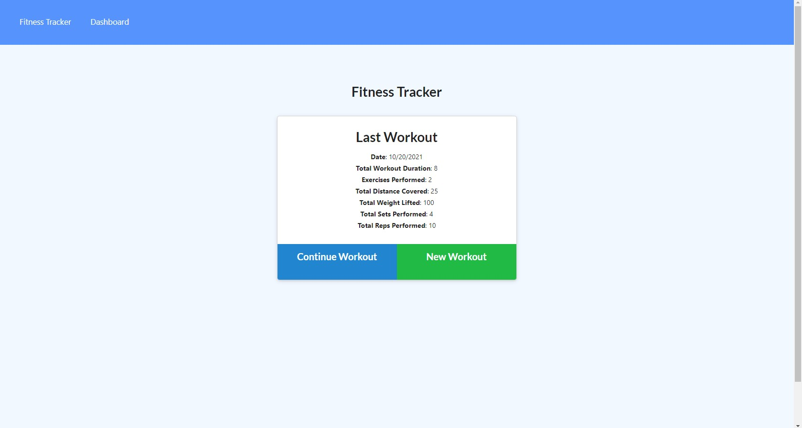

# Workout Tracker
As a gym junkie, I want to be able to view create and track daily workouts. I want to be able to log multiple exercises in a workout on a given day. I should also be able to track the name, type, weight, sets, reps, and duration of exercise. If the exercise is a cardio exercise, I should be able to track my distance traveled.

## Table of Contents
* [Npm Packages](#Npm-Packages)
* [Usage](#Usage)
* [Test](Test)
* [Questions](#Questions)

## Npm Packages 
><b>Required to run this application:</b>
* mongoose
* Express 
* Morgan 

## Usgae
Once the page is loaded, you can begin by creating a new work out or continuing a previous workout. once you click on which option you want, you will be prompted toto enter your workout details. once you enter your workout details, you can either complete your workout or add a new workout. Once you complete your workout, you view your completed workouts in the dashboard. 

## Test
screen shot below:</b>

example of how application works:</b>

 

## Questions
Do you have questions? Contact me here:
* [Github](https://github.com/jameleggleston)
* [Email](jamel.eggleston@gmail.com)

### Application
Here's the link for the deployed application hosted on [Heroku](https://je-workout-tracker.herokuapp.com/?id=6170c394b75c710016e1b151). 

[Back to top](#Workout-Tracker)